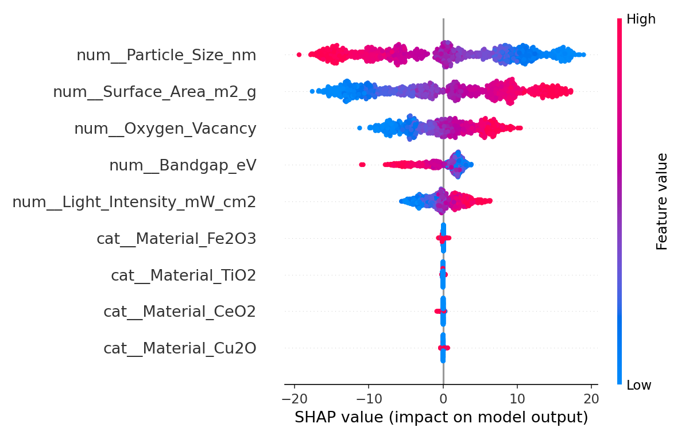

# CatalystML
Attempt-23 Physics-informed machine learning framework for predicting photocatalysts performance using chemically meaningful descriptors.
## Scientific Basis

This dataset is scoped to Cu2O only. The particle-size dependence of
photocatalytic activity is calibrated against real measured rate constants
from:

Tirumala, R. T. A. et al. *ACS Catalysis* 2022, 12, 7975-7985.
https://doi.org/10.1021/acscatal.2c00977

The paper reports a volcano-type relationship between particle size and
photocatalytic rate, driven by dielectric Mie resonance rather than surface
area. This dataset reproduces that relationship rather than assuming
"smaller particles = higher activity."
## Results 

| Model         | R² Score | RMSE |
|---------------|----------|------|
| Random Forest | 0.962    | 0.02 |
| XGBoost       | 0.951    | 0.02 |

The ML pipeline recovers a real, counterintuitive structure-activity relationship (bigger particles can outperform smaller ones due to optical resonance, not surface area) directly from data

### Model Explainability (SHAP)



XGBoost was chosen for SHAP analysis as the stronger-performing model.
Surface area, particle size, and oxygen vacancy density emerge as the
dominant drivers of predicted activity, consistent with the chemistry
used to construct the synthetic dataset.

## Physics-Informed Machine Learning for Photocatalyst Discovery

Machine learning has become a powerful tool for accelerating materials discovery. However, many models behave like black boxes and provide little insight into *why* a material performs well.

This project explores a different approach.

Instead of relying only on statistical correlations, CatalystML uses chemically meaningful descriptors to predict photocatalytic activity and understand the scientific factors that control catalyst performance.

The motivation for this work comes from my research on semiconductor photocatalysts, particularly Cu₂O-based nanostructures, where optical properties, crystal structure, particle morphology, and surface chemistry strongly influence catalytic activity.

The long-term goal of this repository is to demonstrate how machine learning and materials science can work together to accelerate catalyst discovery while maintaining physical and chemical interpretability.

---

## Project Goals

- Build machine learning models for catalyst performance prediction
- Use physically meaningful descriptors instead of arbitrary variables
- Interpret model predictions using Explainable AI (SHAP)
- Compare different machine learning algorithms
- Recommend promising catalyst candidates for future experiments

---

## Planned Workflow

```
Experimental Data
        │
        ▼
Data Cleaning
        │
        ▼
Feature Engineering
        │
        ▼
Machine Learning Models
        │
        ▼
Explainable AI
        │
        ▼
Catalyst Recommendation
```

---

## Repository Structure

```
CatalystML
│
├── data
├── notebooks
├── src
├── models
├── figures
├── results
├── docs
└── tests
```

---

## Current Status

🚧 This repository is under active development. Attempt-23. Improved with new ideas, optimized and fixed bugs from previous attempts stored in a private drive. 

The first version focuses on building an interpretable machine learning workflow for photocatalyst performance prediction.

---

## About Me

I am a materials scientist working at the intersection of heterogeneous catalysis, photocatalysis, nanomaterials, and computational materials science.

My research interests include

- Photocatalysis
- Catalysis
- Machine Learning for Materials
- Materials Informatics
- Computational Materials Science
- Explainable AI

This repository documents my journey toward developing AI-assisted tools for catalyst discovery.
